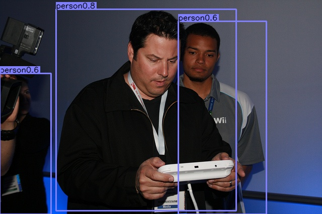
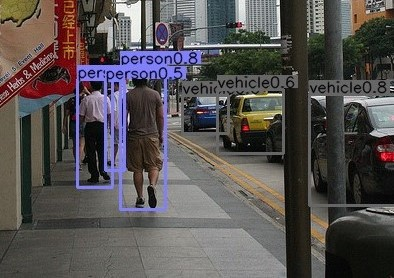
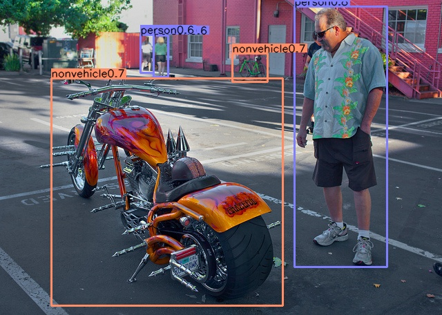

### pruning and finetune results 
### task 1: pruning
network: simple cnn

dataset: mnist

|模型|框架|训练数据集|稀疏率|准确率|
|-|-|-|-|-|
|simple cnn|pytorch|mnist|0|99.0%|
|simple cnn|pytorch|mnist|95%|99.0%|
|simple cnn|tensorflow1.14|mnist|0|98.8%|
|simple cnn|tensorflow1.14|mnist|95%|98.3%|
|simple cnn|mxnet|mnist|0|99.1%|
|simple cnn|mxnet|mnist|95%|98.7%|
---
### task 2: finetune sparse network on classification dataset 
network: sparse resnet50v1d trained and pruned on imagenet 

dataset: cifar10 

|模型|框架|训练数据集|稀疏率|准确率|
|-|-|-|-|-|
|resnet50v1d|pytorch|cifar10|0|93.6%|
|resnet50v1d_224input|pytorch|cifar10|95%|94.8%|
|resnet50v1d_32input|pytorch|cifar10|95%|94.0%|

---

### task 3: finetune sparse network on detection dataset 
network: Moffett IR, sparse resnet50v1d trained and pruned on person-vehicle detection dataset. 

dataset: A person-vehicle detection dataset derived from coco.

|模型|框架|训练数据集|稀疏率|map|
|-|-|-|-|-|
|resnet50v1d + centernet|pytorch|person-vehicle detection|0|28.7%|
|resnet50v1d + centernet|pytorch|person-vehicle detection|80%|30.4%|

<table style="width:100%">
  <tr>
   <th> 
 
  </th>
    <th>

</th>
   <th>

</th>
  </tr>
</table>
